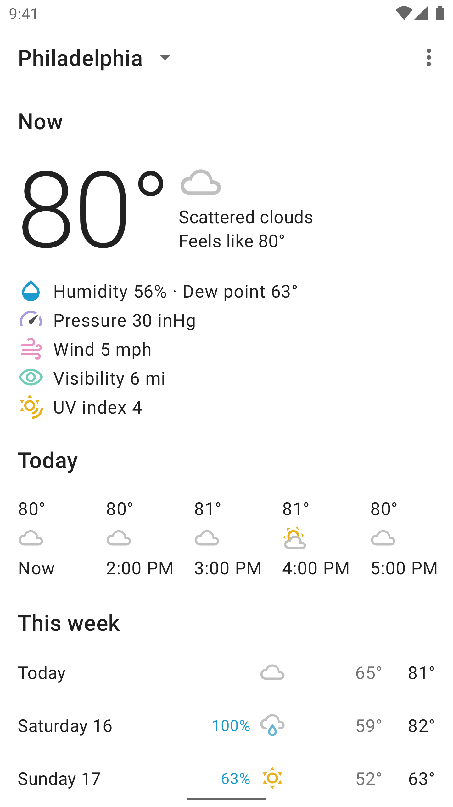
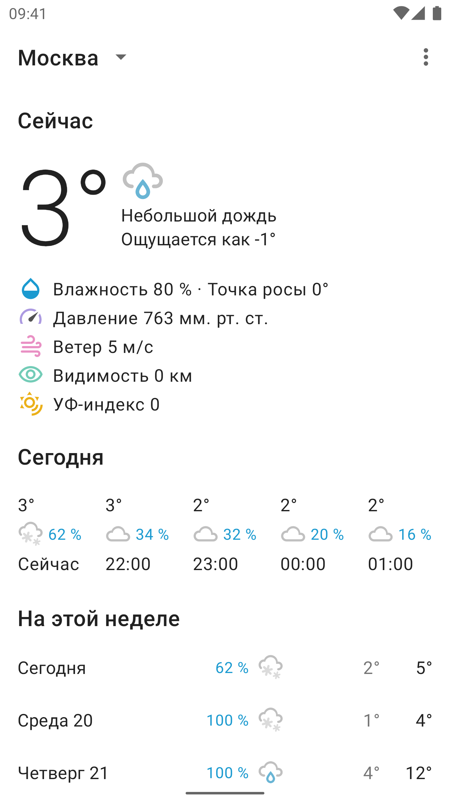
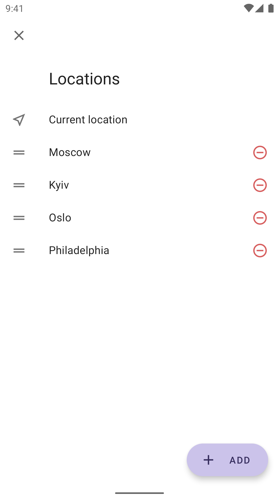
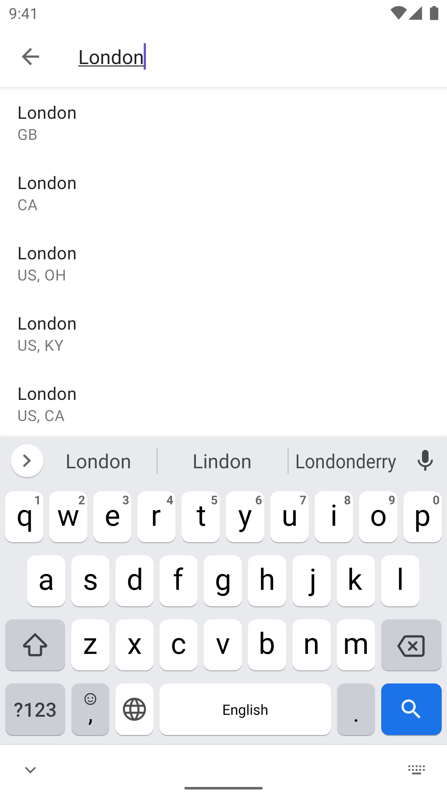
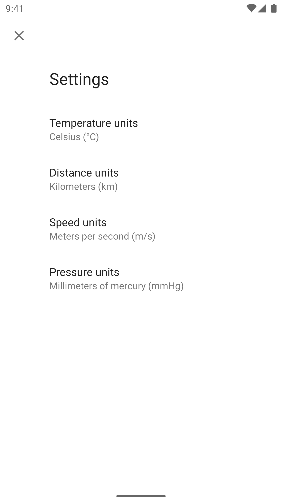

# Cyclone

Cyclone is a minimalistic weather app powered by the OpenWeather API and built for study purposes.

It provides current weather conditions, as well as hourly and daily weather forecast. In addition,
the app features location search capabilities, a list of favorite locations and weather units
customization.

<p>
   
   
   
</p>
<p>
   
   
</p>

## Design notes

The app is designed using layered approach, all app components are grouped into three layers:
presentation, domain and data. The presentation layer is organized using à la MVVM approach.

At the top level, all app classes are packaged by feature, and within each feature the classes are
packaged by layer.

Core technologies: Koin, Coroutines, Retrofit, Moshi, Room, Cicerone.

## Download

[Get the APK here](https://github.com/alex-petrakov/Cyclone/releases)

## Build

To build the app:

1. Obtain the [OpenWeather API key](https://openweathermap.org/api).
2. In the project root directory create a file named `key.properties` with the following content:

```
apiKey="Your_OpenWeather_API_key_obtained_in_step_1"
```

3. Build the project.

## License

```
Copyright (c) 2021 Alexander Petrakov

Permission is hereby granted, free of charge, to any person obtaining a copy
of this software and associated documentation files (the "Software"), to deal
in the Software without restriction, including without limitation the rights
to use, copy, modify, merge, publish, distribute, sublicense, and/or sell
copies of the Software, and to permit persons to whom the Software is
furnished to do so, subject to the following conditions:

The above copyright notice and this permission notice shall be included in all
copies or substantial portions of the Software.

THE SOFTWARE IS PROVIDED "AS IS", WITHOUT WARRANTY OF ANY KIND, EXPRESS OR
IMPLIED, INCLUDING BUT NOT LIMITED TO THE WARRANTIES OF MERCHANTABILITY,
FITNESS FOR A PARTICULAR PURPOSE AND NONINFRINGEMENT. IN NO EVENT SHALL THE
AUTHORS OR COPYRIGHT HOLDERS BE LIABLE FOR ANY CLAIM, DAMAGES OR OTHER
LIABILITY, WHETHER IN AN ACTION OF CONTRACT, TORT OR OTHERWISE, ARISING FROM,
OUT OF OR IN CONNECTION WITH THE SOFTWARE OR THE USE OR OTHER DEALINGS IN THE
SOFTWARE.
```